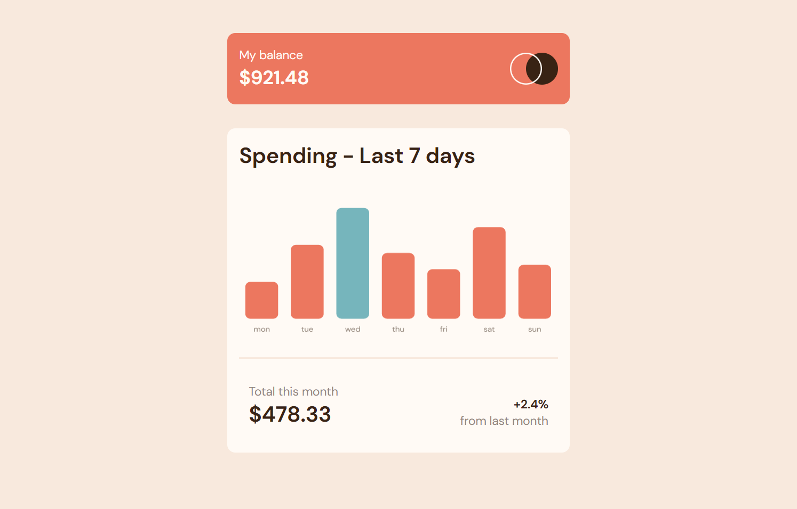
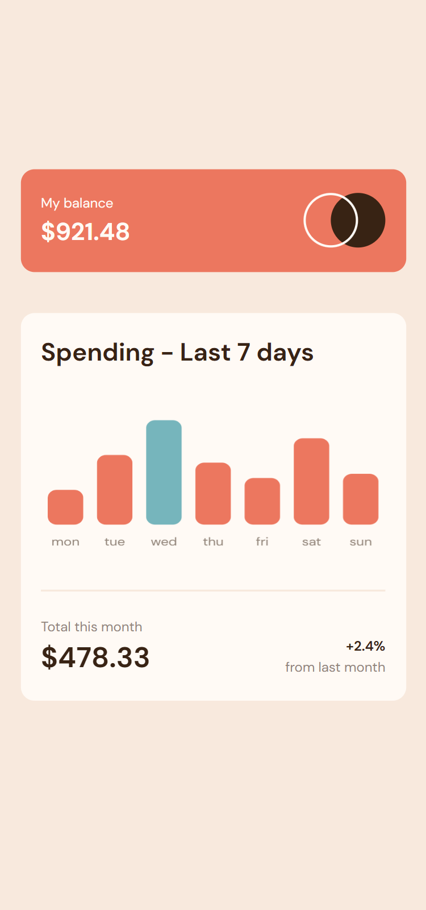

# Frontend Mentor - Expenses chart component solution

This is a solution to the [Expenses chart component challenge on Frontend Mentor](https://www.frontendmentor.io/challenges/expenses-chart-component-e7yJBUdjwt). Frontend Mentor challenges help you improve your coding skills by building realistic projects.

## Table of contents

- [Overview](#overview)
  - [The challenge](#the-challenge)
  - [Screenshot](#screenshot)
  - [Links](#links)
- [My process](#my-process)
  - [Built with](#built-with)
  - [Useful resources](#useful-resources)
- [Author](#author)

**Note: Delete this note and update the table of contents based on what sections you keep.**

## Overview

### The challenge

Users should be able to:

- View the bar chart and hover over the individual bars to see the correct amounts for each day
- See the current day’s bar highlighted in a different colour to the other bars
- View the optimal layout for the content depending on their device’s screen size
- See hover states for all interactive elements on the page
- **Bonus**: Use the JSON data file provided to dynamically size the bars on the chart

### Screenshot

### Links

- Live Site URL: [Live site URL here](https://chart-component.herokuapp.com/)

## My process

### Built with

- HTML5
- CSS custom properties
- Flexbox
- CSS Grid
- Mobile-first workflow
- Vanilla JavaScript

### What I learned

I've used chart.js to make this chart component. I learned how to style this using javascript.

### Useful resources

- [Chart.js docs](https://www.chartjs.org/docs/latest/) - This helped me understand some features of chart.
- Stack overflow ofc.

## Author

- LinkedIn - [Krzysiek Kondracikowski](https://www.linkedin.com/in/krzysztof-kondracikowski-87a3491b3/)
- Frontend Mentor - [@Chris-ai](https://www.frontendmentor.io/profile/Chris-ai)
- Twitter - [@kondr7_krzysiek](https://twitter.com/kondr7_krzysiek)
